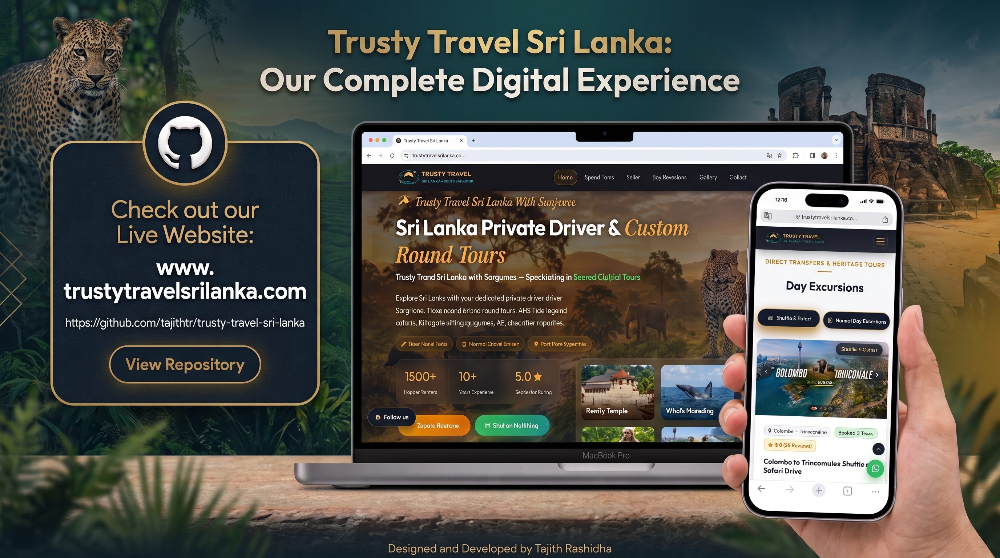

# 🌴 Trusty Travel Sri Lanka

**Full-Stack Tourism & Travel Platform for Sri Lankan Tours, Shuttle Services & Travel Experiences**

Trusty Travel Sri Lanka is a **full-stack tourism and travel web application** designed to promote Sri Lankan travel experiences, tour packages, shuttle services, safari adventures, destinations, and transportation services online.

Developed by **Tajith Rashidha Bandara Ekanayake** during his internship at **Fusion Wave Systems (Pvt) Ltd**, this project demonstrates practical industry experience in **full-stack web development, database integration, responsive design, tourism-focused UI/UX, dynamic content management, SEO, security, and software quality practices.**

---

## 📸 Application Preview



---

## 🌐 Live Website

🔗 https://trustytravelsrilanka.com/

---

## 👨‍💻 Developer

| Information      | Details                                     |
| ---------------- | ------------------------------------------- |
| **Name**         | Tajith Rashidha Bandara Ekanayake           |
| **Role**         | Software Engineer Intern                    |
| **Organization** | Fusion Wave Systems (Pvt) Ltd               |
| **Project**      | Trusty Travel Sri Lanka                     |
| **Type**         | Full-Stack Tourism & Travel Web Application |

---

## ✨ Key Features

### 🌴 Tourism & Travel

* Sri Lankan tour and travel services
* Destination-based travel experiences
* Tour package presentation
* Travel experience cards
* Safari and adventure experiences
* Cultural and nature-focused travel experiences
* Destination-specific travel information

### 🚐 Shuttle & Transportation

* Intercity shuttle services
* Destination-to-destination travel services
* Travel transportation information
* Shuttle tour experiences
* Vehicle and transportation showcases
* Route-based travel experiences

### 🗺️ Destinations & Tours

* Sri Lankan destination highlights
* Tour and destination information
* Travel route presentation
* Tour experience sections
* Destination-focused content
* Travel package showcases

### 🖼️ Gallery & Visual Content

* Travel destination imagery
* Tour experience images
* Vehicle and transportation imagery
* Safari and adventure visuals
* Responsive image galleries
* Tourism-focused visual presentation

### 📱 Web & Responsive Design

* Responsive design for desktop, tablet, and mobile
* Mobile-friendly navigation
* Modern header and footer
* Responsive tour and service cards
* Optimized layouts for different screen sizes
* User-friendly content presentation

### 🔍 SEO & Web Optimization

* SEO-friendly website structure
* Search engine optimization
* XML sitemap
* Robots.txt configuration
* Structured website metadata
* Search-engine-friendly page organization

---

## 🛠️ Technologies Used

**Frontend:**

* HTML5
* CSS3
* JavaScript
* Responsive Web Design

**Backend:**

* PHP
* PDO

**Database:**

* MySQL

**Development Tools:**

* XAMPP
* Git
* GitHub
* Visual Studio Code
* Postman

---

## 🏗️ System Components

* Customer-facing tourism platform
* Tour and package presentation
* Destination management
* Shuttle and transportation services
* Safari and adventure experiences
* Travel experience gallery
* Responsive navigation system
* Reusable PHP components
* Database-driven content
* Contact and call-to-action sections
* SEO implementation
* Security-focused development practices

---

## 🔐 Security Practices

The application follows security-focused development practices, including:

* PDO prepared statements
* Input validation and sanitization
* Session-based security where applicable
* Secure server-side processing
* Access control for protected functionality
* Sensitive configuration protection
* Separation of production credentials from source code

⚠️ **Note:** Production credentials, API keys, database passwords, and other sensitive information are excluded from the repository.

---

## 📁 Repository Structure

```text
Trusty-Travel-Sri-Lanka/

│
├── admin/                  # Administrative functionality
├── assets/                 # CSS, JavaScript and website assets
├── includes/               # Reusable PHP components
├── pages/                  # Website pages
├── uploads/                # Required uploaded/gallery images
│
├── .htaccess               # Server configuration
├── robots.txt              # Search engine crawling configuration
├── sitemap.xml             # Website sitemap
├── app_preview.png         # Application preview
├── README.md               # Project documentation
└── .gitignore              # Git ignored files
```

> **Note:** The repository structure may vary depending on the current implementation. Required website assets, gallery images, and application files are maintained in their respective directories.

---

## 🎯 Project Purpose

Trusty Travel Sri Lanka was developed to establish a professional digital presence for a Sri Lankan tourism and travel company.

The platform is designed to help potential customers:

* Discover Sri Lankan destinations
* Explore available tour packages
* Learn about shuttle and transportation services
* Discover safari and adventure experiences
* View travel destinations and experiences
* Explore travel routes and services
* Access tourism-related information through a modern web interface
* Contact the company regarding travel services

---

## 💼 Development Context

Developed during an internship at **Fusion Wave Systems (Pvt) Ltd**, this project provided practical industry experience in:

* Full-stack web development
* PHP backend development
* MySQL database integration
* Dynamic website development
* Responsive UI/UX implementation
* Tourism and travel platform development
* Image and gallery management
* SEO optimization
* Website performance considerations
* Security-focused development
* Git and GitHub version control
* Software quality practices

---

## 📌 Project Status

🟢 **Live & Hosted**

**Website:**
https://trustytravelsrilanka.com/

---

## 📄 License

This repository does **not** grant unrestricted reuse, redistribution, or commercial use of the source code, design, branding, images, or other project assets.

➡️ Please contact the developer and/or respective project owner before reusing substantial portions of this project for personal or commercial purposes.

---

<div align="center">

🌴 **Trusty Travel Sri Lanka**

<br>

**Travel • Explore • Experience Sri Lanka**

<br>

Developed by **Tajith Rashidha Bandara Ekanayake**

<br>

**Fusion Wave Systems (Pvt) Ltd**

</div>
